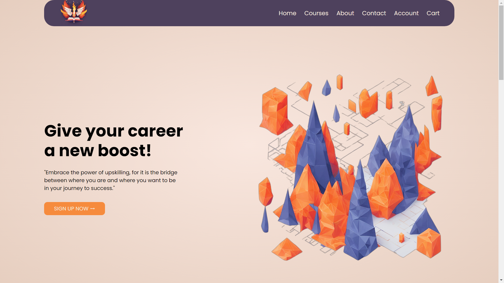
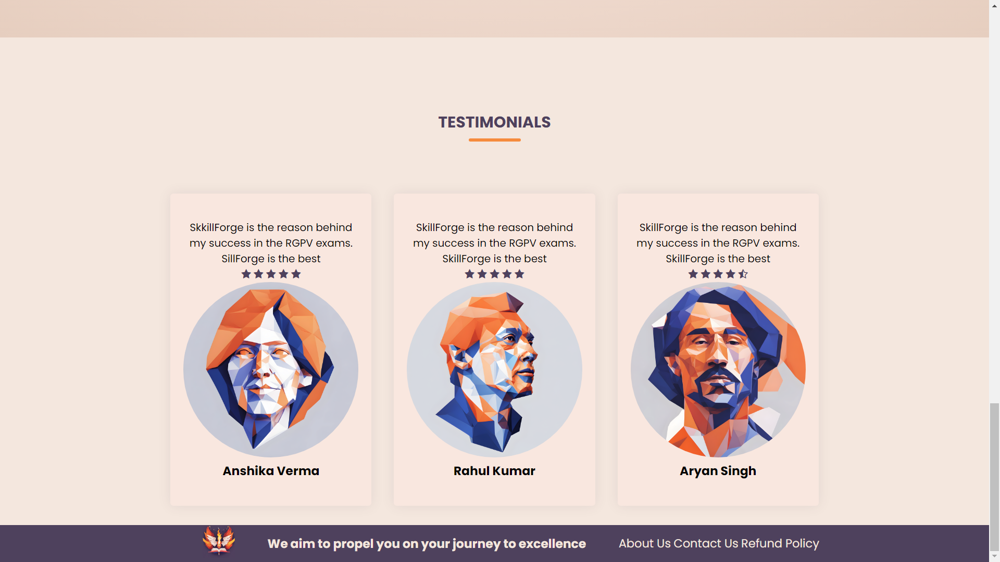
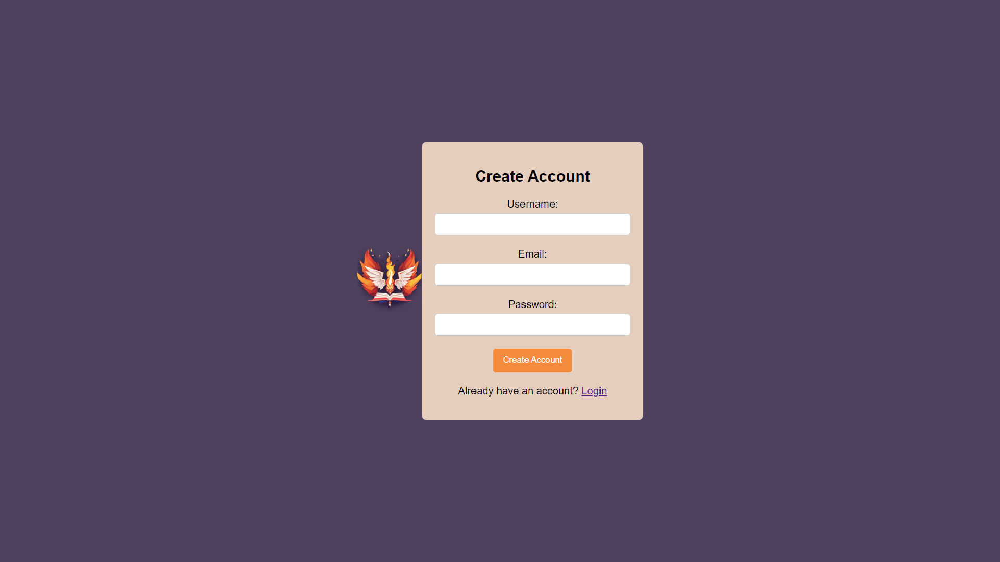

# SkillForge

**A clean and responsive e-learning website UI for browsing engineering-focused courses, learning resources, and student account pages.**


<center>

[](https://ishpeeedy.github.io/Skillforge/)

</center>

## Features

- **Landing Experience** — hero section, value proposition, and clear signup CTA
- **Course Catalog UI** — structured course cards with thumbnails, ratings, and pricing
- **Featured Categories** — quick discovery of key learning domains
- **Student Journey Pages** — About, Create Account, Login, and course material preview pages
- **Responsive Layout** — mobile-friendly structure using reusable CSS sections
- **Resource-Driven Design** — local image assets and PDF-based learning content integration

## Screenshots





|                                      |                                    |
| ------------------------------------ | ---------------------------------- |
|  |  |

## Getting Started

### Installation

```bash
# Clone the repo
git clone https://github.com/ishpeeedy/Skillforge.git
cd Skillforge
```

### Run Locally

Because this is a static website, you can open the homepage directly:

```bash
# Windows
start index.html
```

Or use VS Code Live Server for a better development experience.

## Deployment

The project is deployed on GitHub Pages:

- **Live URL:** https://ishpeeedy.github.io/Skillforge/
- **Publishing source:** `main` branch

If the homepage shows 404, ensure `index.html` exists at the repository root.
